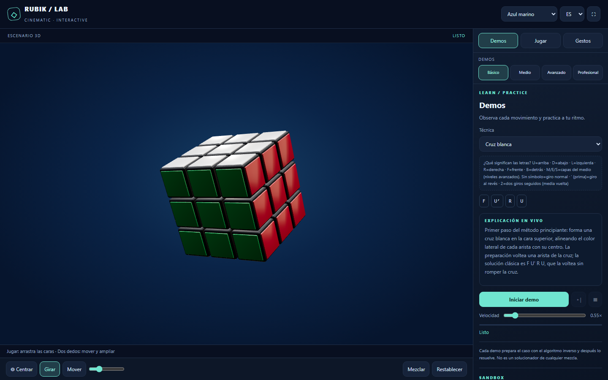
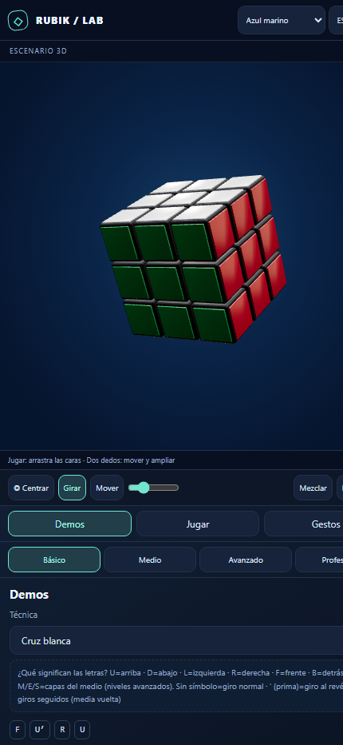

# Rubik · Cinematic Lab

**Un cubo de Rubik 3D fotorrealista que no solo se mueve: te explica, en vivo y en tu idioma, por qué cada giro te acerca a resolverlo.**

**Pruébalo ahora, sin instalar nada:** **https://niki2510.github.io/kubik-rubik/**

---

## Antes de nada: ¿qué significan estas letras? (léelo primero, un minuto)

Si ves algo como `R U R' U'` y no tienes ni idea de qué significa, tranquilo: es normal, nadie nace sabiéndolo. Vamos a explicarlo muy despacio, como si fuera la primera vez que ves un cubo de Rubik en tu vida.

Coge el cubo con la mente (o uno físico, si tienes uno a mano) y déjalo quieto delante de ti, sin moverlo todavía. Tiene 6 caras. Cada cara tiene una letra, y esa letra es simplemente la inicial de **dónde está** esa cara en este momento:

| Letra | Nombre completo | En plan sencillo: es la cara que... |
|---|---|---|
| **F** | *Front* (frente) | ...te está mirando a ti ahora mismo. |
| **B** | *Back* (detrás) | ...está al otro lado, la que no ves. |
| **U** | *Up* (arriba) | ...mira hacia el techo. |
| **D** | *Down* (abajo) | ...toca la mesa. |
| **L** | *Left* (izquierda) | ...está hacia tu mano izquierda. |
| **R** | *Right* (derecha) | ...está hacia tu mano derecha. |

Eso es todo. 6 caras, 6 letras. No hay ningún truco ni nada que memorizar: es solo un nombre para cada lado.

Cuando una "receta" de movimientos (eso es un **algoritmo**: una lista ordenada de giros que, si la sigues bien, resuelve un problema concreto) te dice una letra sola, por ejemplo **R**, solo quiere decir una cosa, y nada más que esa:

> Coge esa cara del cubo (en este caso, la de la derecha) y gírala **una vez**, 90 grados, como quien gira el pomo redondo de una puerta.

Ahora, dos símbolos extra que verás constantemente pegados a las letras:

- **Un apóstrofe detrás de la letra, como `R'`** (se dice "R prima", y significa "R al revés" o "R inversa"): es el mismo giro, pero **hacia el lado contrario**. Si con `R` giras hacia un sentido, con `R'` deshaces exactamente ese giro.
- **Un 2 detrás de la letra, como `R2`**: gira esa misma cara **dos veces seguidas** (media vuelta completa, 180°). Da igual hacia qué lado la gires las dos veces: el resultado final es idéntico.

Con solo esto ya puedes leer **cualquier** algoritmo de toda la app, sin excepción. Vamos a probarlo con el primero que te vas a encontrar, `F U' R U`. Leído muy despacio, paso a paso, en voz alta, dice:

1. `F` → gira la cara de **delante**, una vez, en el sentido normal.
2. `U'` → gira la cara de **arriba**, una vez, pero **al revés**.
3. `R` → gira la cara de la **derecha**, una vez, en el sentido normal.
4. `U` → gira otra vez la cara de **arriba**, una vez, en el sentido normal (deshaciendo el giro al revés de antes).

Cuatro pasos. Ni más ni menos. Y la app hace exactamente esto delante de tus ojos, en 3D, mientras te lo escribe en pantalla en tiempo real para que jamás te pierdas en qué paso vas.

Solo en los niveles más avanzados aparecen tres letras más: **M**, **E** y **S**. No son caras exteriores, son "rebanadas" que están justo en el centro del cubo, entre dos caras opuestas:

| Letra | Nombre completo | Dónde está | Gira igual que la cara... |
|---|---|---|---|
| **M** | *Middle* (del medio) | la rebanada vertical entre L y R | **L** |
| **E** | *Equatorial* (ecuador) | la rebanada horizontal entre U y D | **D** |
| **S** | *Standing* (en pie) | la rebanada entre F y B | **F** |

No hace falta que memorices nada de esta tabla ahora mismo: la propia app te recuerda estos significados en todo momento, y además te explica cada movimiento, uno por uno, mientras lo ves ocurrir en tiempo real. Esta chuleta solo es para que la primera vez que veas una letra suelta, nunca te quedes en blanco.

---

## ¿Qué es esto?

Es un laboratorio interactivo del cubo de Rubik que corre entero en el navegador (móvil u ordenador), con render 3D realista, física de giros reales y un sistema de aprendizaje guiado: eliges una técnica, le das a reproducir, y el cubo se resuelve ese caso paso a paso mientras un texto va apareciendo **en tiempo real, letra a letra**, explicándote qué está pasando y por qué funciona.

No es un vídeo. No es una animación pregrabada. Es una simulación real del cubo que tú también puedes coger, girar, desmontar y mezclar con tus propias manos (o dedos, en el móvil).

## ¿Por qué debería importarte si tienes 12, 15 o 20 años?

Porque el cubo de Rubik es uno de los pocos "juguetes" que es, a la vez, deporte mental, rompecabezas matemático y entrenamiento de cerebro — y la mayoría de la gente nunca pasa de moverlo al azar durante cinco minutos y rendirse. Esta aplicación existe para que eso no te pase a ti: te enseña **el método real que usan los speedcubers** (las personas que resuelven el cubo en menos de 10 segundos), explicado movimiento a movimiento, no memorizado de carrerilla.

### Lo que tu cerebro entrena sin que te des cuenta

| Lo que haces en la app | Lo que entrena en tu cabeza |
|---|---|
| Seguir una pieza concreta mientras giras varias capas | **Memoria de trabajo** — sostener información mientras la manipulas, la misma habilidad que usas en exámenes y cálculo mental |
| Anticipar cómo quedará el cubo antes de girar | **Rotación mental y visión espacial 3D** — clave en geometría, arquitectura, ingeniería, cirugía, pilotaje |
| Reconocer que "esta forma amarilla ya la he visto" | **Reconocimiento de patrones** — la base de cómo aprenden tanto los ajedrecistas como las IA |
| Ejecutar una secuencia de 8-14 giros sin pensar en cada uno | **Memoria muscular y automatización** — cómo tu cerebro convierte "pensar mucho" en "hacerlo sin esfuerzo" |
| Quedarte en un algoritmo hasta que te sale fluido | **Paciencia, tolerancia a la frustración y disciplina de práctica** — lo que de verdad separa a quien mejora de quien lo deja |

Resolver el cubo no es un truco de memoria: es **pensamiento algorítmico aplicado con las manos**. Y el pensamiento algorítmico es, literalmente, la habilidad detrás de la programación, la ingeniería y buena parte de la ciencia moderna.

## La parte de matemáticas y lógica (la interesante de verdad)

El cubo de Rubik no es solo un juguete — es un objeto matemático real que se estudia en teoría de grupos:

- **Permutaciones**: cada giro es una permutación de 20 piezas móviles. Aprender un algoritmo es, sin saberlo, aprender a componer permutaciones — la misma matemática que hay detrás de la criptografía y de cómo se barajan las cartas.
- **Combinatoria**: el cubo tiene **43 252 003 274 489 856 000** combinaciones posibles (más de 43 trillones — un número con 20 cifras, imposible de imaginar). Y aun así, está demostrado que **cualquier** combinación, por mezclada que esté, se puede resolver en 20 movimientos o menos (a este resultado se le llama "el Número de Dios", porque parecía demasiado bueno para ser verdad). Entender por qué algo tan enorme se resuelve con tan pocos pasos es, en sí mismo, una lección de combinatoria y optimización.
- **Invariantes**: hay propiedades del cubo que un giro normal nunca puede romper (como la paridad de las esquinas). Reconocer qué cambia y qué se mantiene fijo tras una operación es exactamente el mismo razonamiento que se usa para demostrar teoremas o depurar un programa.
- **Algoritmos y notación**: cada técnica (`R U R' U'`, `R U R' U R U2 R'`...) es literalmente un **programa corto**: una secuencia de instrucciones con una entrada (el estado mezclado), una condición y una salida (el estado resuelto). Si alguna vez programas, esta notación te va a sonar sospechosamente familiar.
- **Simetría y geometría**: el cubo vive en el grupo de simetrías de un objeto 3D. Jugar con él a mano construye la intuición geométrica que luego hace más fácil entender matrices de rotación, trigonometría o incluso gráficos por computadora (de hecho, así es como está hecho este cubo: con las mismas matemáticas 3D que usan los videojuegos).

En resumen: cada vez que resuelves una capa, estás usando (sin darte cuenta) las mismas ideas que hay detrás de la teoría de grupos, la combinatoria y los algoritmos. Es matemática de verdad, disfrazada de juguete.

## ¿Qué puedes aprender exactamente dentro de la app?

La app sigue el **método por capas para principiantes** (el mismo con el que empieza casi cualquier speedcuber), dividido en 4 niveles progresivos:

1. **Básico** — giros fundamentales y la "cruz blanca": colocar cuatro piezas blancas formando una cruz en la cara de arriba.
2. **Medio** — completar la segunda capa y formar una cruz amarilla en la cara de abajo del todo (la última).
3. **Avanzado** — **PLL** (de *Permutate Last Layer*, "permutar la última capa"): las piezas de arriba ya están orientadas, pero no en el orden correcto — aquí aprendes a intercambiarlas de sitio hasta que cada color coincide con el de su cara.
4. **Profesional** — **OLL** (de *Orient Last Layer*, "orientar la última capa"): conseguir que todas las pegatinas de arriba miren hacia arriba (sin importar aún el orden), más combinaciones encadenadas de varias técnicas — el terreno de quien ya quiere ser rápido de verdad.

Para cada técnica, la app:

- Te muestra el algoritmo exacto, movimiento a movimiento.
- Lo ejecuta en 3D delante de ti, a la velocidad que elijas.
- Te explica **en vivo, con efecto de máquina de escribir**, qué hace cada giro (qué capa gira, en qué sentido) y por qué esa técnica funciona — en **español, inglés o ruso**.
- Te deja pausar, avanzar paso a paso o repetirlo las veces que haga falta hasta que se quede en tus dedos.

## Controla el cubo como quieras

- **Ratón/dedo**: arrastra una cara para girarla, arrastra el fondo para orbitar la cámara.
- **Dos dedos / rueda del ratón**: acerca o aleja el cubo.
- **Flechas del teclado**: gira la vista libremente, sin límites, como si lo tuvieras en la mano.
- **Modo Jugar**: palanca de órbita, rueda de giro por capas y control manual total para practicar libremente.
- **Pantalla completa** y **3 idiomas** (ES / EN / RU) en toda la interfaz.

## ¿Para quién es esto?

- Para quien quiere aprender a resolver el cubo **de verdad**, entendiendo el porqué, no copiando un vídeo a trompicones.
- Para quien ya sabe resolverlo y quiere entrenar las técnicas rápidas de competición (PLL/OLL) sin gastar un cubo físico.
- Para profesores que quieran una forma visual y gratuita de explicar permutaciones, combinatoria o pensamiento algorítmico en clase.
- Para cualquiera que quiera un ratito de entrenamiento mental distinto a mirar el móvil.

## Tecnología

Aplicación 100% estática en un único archivo HTML: React + Three.js (renderizado 3D en WebGL), sin backend ni instalación. Funciona offline una vez cargada y en cualquier navegador moderno, de escritorio o móvil.

---

¿Tienes un cubo físico en un cajón? Ya sabes qué hacer con él esta noche.
